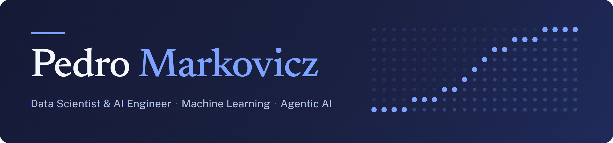
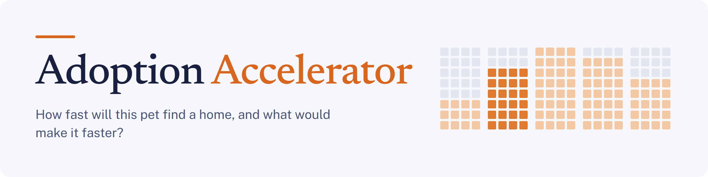

### I build machine learning and agentic AI systems and put them into production

 

<!-- When the portfolio site exists, put its button here:

-->

 

## About me

I'm Pedro, a Data Scientist and AI Engineer. I trained as an engineer before moving into data science, and I work on machine learning and AI systems that run in production and answer a business question.

My experience covers forecasting and churn pipelines on Azure and Google Cloud, a multi-agent LangGraph system for analyzing commercial data, and LLM and computer vision workflows that review engineering documents. Agentic AI is the area I'm most interested in, and healthcare is a personal interest: my Master's dissertation in Data Science explores agents and RAG to make institutional clinical information easier to access.

I'm a Google Certified Professional Machine Learning Engineer, and I'm interested in **Data Scientist** and **AI Engineer** roles.

<table>
<tr>
<td width="33%" valign="top">

### Agentic AI and RAG

I build multi-agent systems with LangGraph, DuckDB and Polars, and use context engineering so the model works from the client's rules and data schemas.

</td>
<td width="33%" valign="top">

### Production ML

I've built pipelines for multivariate time series, survival analysis for predictive maintenance, inventory optimization and customer retention.

</td>
<td width="33%" valign="top">

### MLOps and cloud

I deploy models and workflows on GCP (Vertex AI and Cloud Run) with Docker and CI/CD pipelines.

</td>
</tr>
</table>

## Featured projects

<table>
<tr>
<td width="50%" valign="top">

**How fast will this pet find a home, and what would make it faster?**

- A team of LangGraph agents explains each prediction and rewrites the pet's listing
- Behind them, a gradient-boosting ensemble reads the listing's attributes, text and photos
- FastAPI backend with a Next.js app on top

</td>
<td width="50%" valign="top">

**Which customers are worth a retention offer, and what is that worth in money?**

- The data came with no churn label, so I built one from each customer's buying rhythm
- A calibrated LightGBM model and the campaign's economics decide who is worth a call
- You can try the campaign simulator in the browser

</td>
</tr>
</table>

## Tech stack

| Area | Tools |
|---|---|
| **Generative AI and agents** |      |
| **Machine learning** |       |
| **Data** |       |
| **Cloud and MLOps** |       |
| **Apps and APIs** |     |

## More work

- [Fiscal data extraction](https://github.com/PedroMarkovicz/ProjetoFinal_I2A2_ExtracaoDadosFiscais), a multi-agent system built with LangGraph and LangChain that reads Brazilian electronic invoices (NF-e) in XML and PDF.
- [EDA Agent](https://github.com/PedroMarkovicz/EDA_Agent_I2A2), a LangGraph agent for interactive exploratory data analysis, deployed with Streamlit.
- [Gaia Agent](https://github.com/PedroMarkovicz/Gaia_Agent_HF_Course), my final project for the Hugging Face Agents course, with a [Space](https://huggingface.co/spaces/PedroMark/Gaia_Agent_v02) to try it.
- I also write on [Medium](https://medium.com/@PedroMarkovicz).
